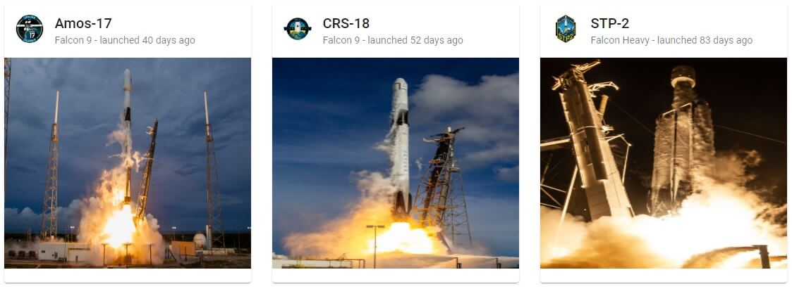
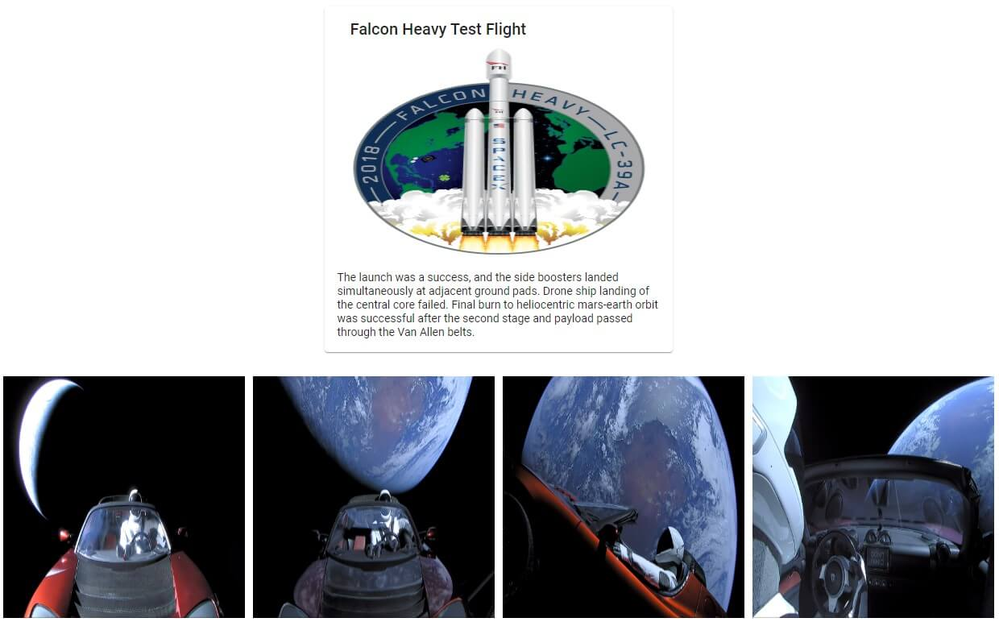

# Angular Spacex Graphql Codegen

## Mission

Our goal is to make an Angular app with a list of the past SpaceX launches along with an associated details page. Data is provided via the [SpaceX GraphQL API](https://medium.com/open-graphql/launching-spacex-graphql-api-b3d7029086e0) and Angular services are generated via [GraphQL Code Generator](https://graphql-code-generator.com/). We use [Apollo Angular](https://www.apollographql.com/docs/angular/) to access data from the frontend. The API is free so please be nice and don't abuse it.

## End Result





## Steps

1. Generate a new angular application with routing

   ```bash
   ng new angular-spacex-graphql-codegen --routing=true --style=css
   ```

   Make sure to delete the default template in `src/app/app.component.html`

1. Install the [Apollo VS Code plugin](https://marketplace.visualstudio.com/items?itemName=apollographql.vscode-apollo) and in the root of the project add `apollo.config.js`

   ```javascript
   module.exports = {
     client: {
       service: {
         name: 'angular-spacex-graphql-codegen',
         url: 'https://api.spacex.land/graphql/'
       }
     }
   };
   ```

   This points the extension at the SpaceX GraphQL API so we get autocomplete, type information, and other cool features in GraphQL files. You may need to restart VS Code.

1. Generate our two components:

   ```bash
   ng g component launch-list --changeDetection=OnPush
   ```

   ```bash
   ng g component launch-details --changeDetection=OnPush
   ```

   Because our generated services use observables we choose OnPush change detection for the best performance.

1. In `src/app/app-routing.module.ts` we setup the routing:

   ```typescript
   import { LaunchListComponent } from './launch-list/launch-list.component';
   import { LaunchDetailsComponent } from './launch-details/launch-details.component';

   const routes: Routes = [
     {
       path: '',
       component: LaunchListComponent
     },
     {
       path: ':id',
       component: LaunchDetailsComponent
     }
   ];
   ```

1. Each component will have its own data requirments so we co-locate our graphql query files next to them

   ```graphql
   # src/app/launch-list/launch-list.graphql

   query pastLaunchesList($limit: Int!) {
     launchesPast(limit: $limit) {
       id
       mission_name
       links {
         flickr_images
         mission_patch_small
       }
       rocket {
         rocket_name
       }
       launch_date_utc
     }
   }
   ```

   ```graphql
   # src/app/launch-details/launch-details.graphql

   query launchDetails($id: ID!) {
     launch(id: $id) {
       id
       mission_name
       details
       links {
         flickr_images
         mission_patch
       }
     }
   }
   ```

   Note the first line: `query launchDetails($id: ID!)` When we generate the Angular service the query name is turned into PascalCase and GQL is appended to the end, so the service name for the launch details would be LaunchDetailsGQL. Also in the first line we define any variables we'll need to pass into the query. Please note it's import to include id in the query return so apollo can cache the data.

1. We add [Apollo Angular](https://www.apollographql.com/docs/angular/) to our app with `ng add apollo-angular`. In `src/app/graphql.module.ts` we set our API url `const uri = 'https://api.spacex.land/graphql/';`.

1. Install Graphql Code Generator and the needed plugins `npm i --save-dev @graphql-codegen/cli @graphql-codegen/typescript @graphql-codegen/typescript-apollo-angular @graphql-codegen/typescript-operations`

1. In the root of the project create a `codegen.yml` file:

   ```yml
   # Where to get schema data
   schema:
     - https://api.spacex.land/graphql/
   # The client side queries to turn into services
   documents:
     - src/**/*.graphql
   # Where to output the services and the list of plugins
   generates:
     ./src/app/services/spacexGraphql.service.ts:
       plugins:
         - typescript
         - typescript-operations
         - typescript-apollo-angular
   ```

1. In package.json add a script `"codegen": "gql-gen"` then `npm run codegen` to generate the Angular Services.

1. To make it look nice we add Angular Material `ng add @angular/material` then in the `app.module.ts` we import the card module and add to the imports array: `import { MatCardModule } from '@angular/material/card';`

1. Lets start with the list of past launches displayed on the screen:

   ```typescript
   import { map } from 'rxjs/operators';
   import { PastLaunchesListGQL } from '../services/spacexGraphql.service';

   export class LaunchListComponent {
     constructor(private readonly pastLaunchesService: PastLaunchesListGQL) {}

     // Please be careful to not fetch too much, but this amount lets us see lazy loading imgs in action
     pastLaunches$ = this.pastLaunchesService
       .fetch({ limit: 30 })
       // Here we extract our query data, we can also get info like errors or loading state from res
       .pipe(map((res) => res.data.launchesPast));
   }
   ```

   ```html
   <ng-container *ngIf="pastLaunches$ | async as pastLaunches">
     <main>
       <section class="container">
         <mat-card
           *ngFor="let launch of pastLaunches"
           [routerLink]="['/', launch.id]"
         >
           <mat-card-header>
             
             <mat-card-title>{{ launch.mission_name }}</mat-card-title>
             <mat-card-subtitle
               >{{ launch.rocket.rocket_name }}</mat-card-subtitle
             >
           </mat-card-header>
           
         </mat-card>
       </section>
     </main>
   </ng-container>
   ```

   Notice the cool addition of [lazy loading images](https://web.dev/native-lazy-loading), if you emulate a mobile device in Chrome and fetch enough launches you should see the images lazy load while you scroll!

   To make it look nice we add CSS Grid

   ```css
   .container {
     padding-top: 20px;
     display: grid;
     grid-gap: 30px;
     grid-template-columns: repeat(auto-fill, 350px);
     justify-content: center;
   }

   .mat-card {
     cursor: pointer;
   }
   ```

1. Next we make the details page for a launch, we get the id from the route params and pass that to our service

   ```typescript
   import { ActivatedRoute } from '@angular/router';
   import { map, switchMap } from 'rxjs/operators';
   import { LaunchDetailsGQL } from '../services/spacexGraphql.service';

   export class LaunchDetailsComponent {
     constructor(
       private readonly route: ActivatedRoute,
       private readonly launchDetailsService: LaunchDetailsGQL
     ) {}

     launchDetails$ = this.route.paramMap.pipe(
       map((params) => params.get('id') as string),
       switchMap((id) => this.launchDetailsService.fetch({ id })),
       map((res) => res.data.launch)
     );
   }
   ```

   The HTML looks very similar to the list of launches

   ```html
   <ng-container *ngIf="launchDetails$ | async as launchDetails">
     <section style="padding-top: 20px;">
       <mat-card style="width: 400px; margin: auto;">
         <mat-card-header>
           <mat-card-title>{{ launchDetails.mission_name }}</mat-card-title>
         </mat-card-header>
         
         <mat-card-content>
           <p>{{ launchDetails.details }}</p>
         </mat-card-content>
       </mat-card>
     </section>
     <section class="photo-grid">
       
     </section>
   </ng-container>
   ```

   Finally we add CSS Grid for the pictures

   ```css
   .photo-grid {
     padding-top: 30px;
     display: grid;
     grid-gap: 10px;
     grid-template-columns: repeat(auto-fill, 300px);
     justify-content: center;
   }
   ```

1. `npm start`, navigate to `http://localhost:4200/`, and it should work!

### Extra Credit: Relative launch times

Thanks to the new builtin [relative time formating](https://v8.dev/features/intl-relativetimeformat) in V8, we can add `launched x days ago`

1. Generate the pipe: `ng g pipe relative-time --module=app.module --flat=false`

1. The pipe takes in the UTC time and returns a formatted string

   ```typescript
   import { Pipe, PipeTransform } from '@angular/core';

   const milliSecondsInDay = 1000 * 3600 * 24;

   // Cast as any because typescript typing haven't updated yet
   const rtf = new (Intl as any).RelativeTimeFormat('en');

   @Pipe({
     name: 'relativeTime'
   })
   export class RelativeTimePipe implements PipeTransform {
     transform(utcTime: string): string {
       const diffInMillicseconds =
         new Date(utcTime).getTime() - new Date().getTime();
       const diffInDays = Math.round(diffInMillicseconds / milliSecondsInDay);
       return rtf.format(diffInDays, 'day');
     }
   }
   ```

1. Add the pipe to our launch card in src/app/launch-list/launch-list.component.html

   ```html
   <mat-card-subtitle
     >{{ launch.rocket.rocket_name }} - launched {{ launch.launch_date_utc |
     relativeTime }}</mat-card-subtitle
   >
   ```
